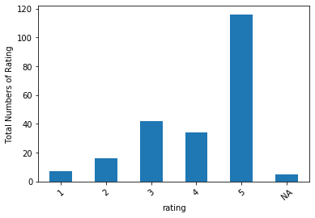
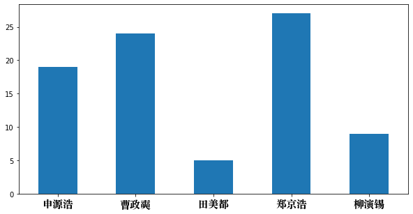

# Drama Review

A experimental analysis of drama "Hospital Playlist" based on 220 reviews from Chinese drama review website <a href="www.douban.com" target="_blank">Douban</a>.

<h3>Pipeline</h3>
<ol>
<li>Crawl data from the website via API call and save as csv file</li>
<li>Plot bar chart from the rating count</li>
<li>Filter stopword from reviews and generate wordcloud using _wordcloud_ and _jieba_ package</li>
<li>Count the mention of characters/actors/relevant people in the drama, plot bar chart</li>
</ol>

<h3>Analysis criteria</h3>
<ul>
<li>Overall rating from the reviews</li>
 
<li>Generation of wordcloud to identify the frequent keywords in the reviews</li>
<li>Popular character/actor/people in the drama based on number of mentions</li>

</ul>

<h3>Analysis Result</h3>
 
  This drama is generally well received by the viewers.
  
 
There are two types of words, emotion-denoting and descriptive. They are generally positive words, indicating a positive sentiment towards the drama.
  

Some characters/actors receive more attention from the viewers compared to others, which would be used to infer the reasons of the drama's popularity.
          
